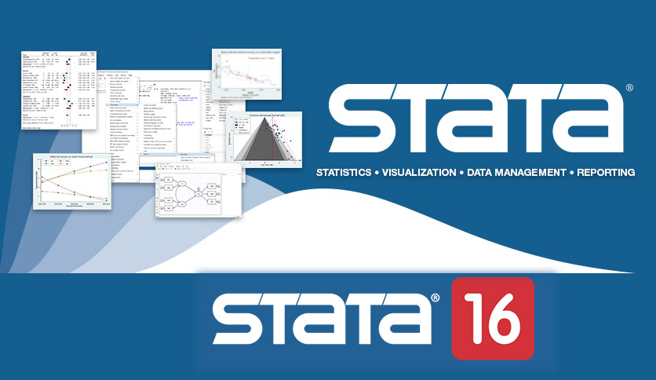

# Stata-司继春

 

# 课程概览

- 2021年7月17-18日
- 小鹅通平台(线上直播)  
- **2000元；回放10天**
- 每天6小时（8:30 — 11:30；14:00 — 17:00）+ 30分钟答疑
- 软件：Stata 14及以上

## 课程大纲

- 线性回归与Stata基础 
- 线性面板数据模型 
- 双重差分模型及新进展 
- 面板二元选择模型

## 讲师：

**司继春**（慧航）：上海对外经贸大学统计与信息学院助理教授，主要研究领域为微观计量经济学、产业组织理论。在 Journal of Business and Economic Statistics、《财经研究》等学术刊物上发表多篇论文。其实，大家更熟悉的是知乎上大名鼎鼎的[慧航]，拥有 294,929 个关注者，获得过 151,655 次赞同，他就是司继春老师 —— [慧航]。

 

# 课程目录

## Part1 线性回归与Stata基础 (7.17 am  )

- 线性回归模型基础
- 系数的解释与模型设定：平方项、交叉项的解读与使用
- 系数的解释与模型设定：加权最小二乘以及权重的使用
- 线性回归中固定效应的使用
- 控制变量的选择
- 统计推断：异方差稳健标准误与聚类标准误
- 跨方程假设检验

## Part2 线性面板数据模型(7.17 pm)

- 面板数据的基本设定
- 随机效应模型与混合最小二乘
- 一阶差分模型与固定效应模型
- 不同估计量之间的关系和选择
- 线性面板数据中的时间固定效应与时间趋势
- 交互固定效应模型

## Part3 双重差分模型及其新进展(7.18 am)

- 双重差分模型的基本设定及共同趋势假设
- 双重差分模型的标准设定
- 多期的双重差分模型设定
- 平行趋势检验的方法
- 三重差分模型、回归控制法简介
- 模糊双重差分模型（Fuzzy DID）
- 带有异质性的动态处理效应的估计（Sun、Abraham, 2020; Callaway、San’t Anna，2020）

## Part4 面板二元选择模型(7.18 pm)

- 基本的Probit、Logit回归简介
- 二元选择模型中系数的解释和汇报
- 随机效应Probit、Logit回归
- 固定效应Probit、Logit回归

 

# 报名信息

## 参加对象

全国高等院校及研究机构从事经济科学研究的青年师生。尤其适合那些希望掌握高级实证方法，提升量化研究设计能力和国家课题申报能力的研究者。

## 报名时间

 从即日起

## 缴费信息

单位：杭州国商智库信息技术服务有限公司

开户银行： 中国银行杭州大学城支行

银行账户：6232636200100260588

## 费用

- **2000元；回放10天**

- **优惠政策：** 报名两位老师的课程9折；三位老师的课程8折；四位老师的课程7.5折；三人成团及以上9折；五人成团及以上8折；老学员9折；学生优惠200元/人；各类叠加不超过7.5折。

（注：**为扩大学员们的选择空间，可单独选择报名一位老师或几位老师的课程，也可组团报名，详情咨询文末陈老师**）

## 报名咨询

- 13967800957（同微信）（陈老师）

欢迎咨询！
